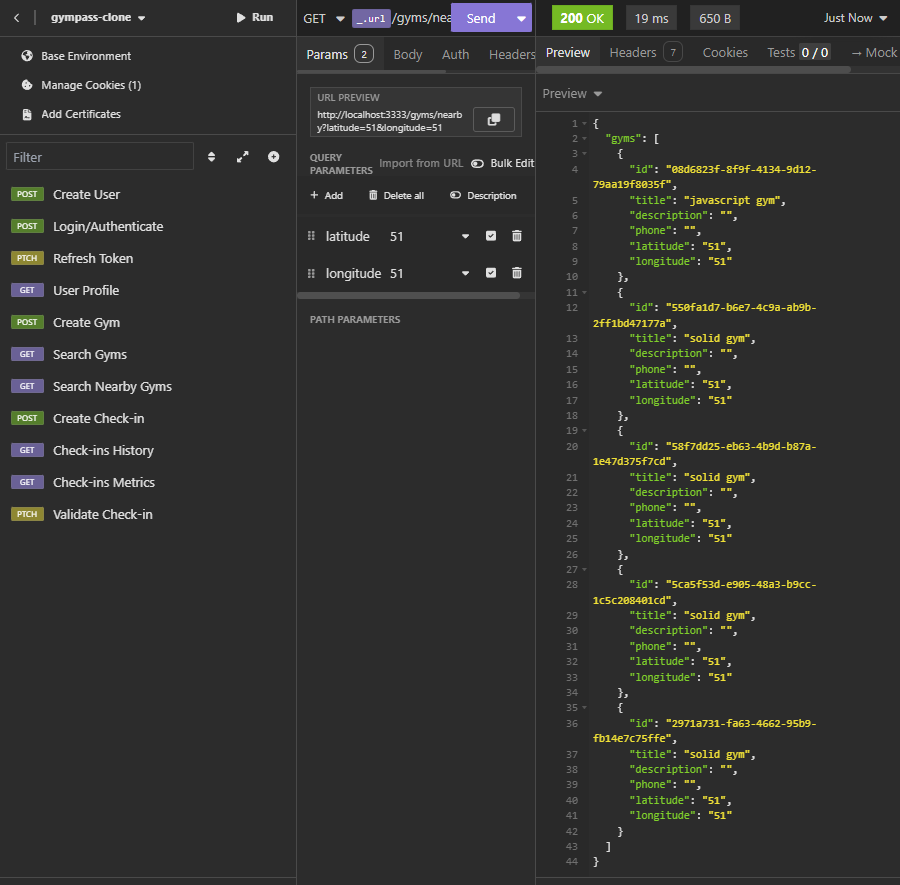
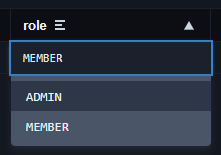

# Gympass clone with Node | Fastify | Solid | JWT



## Summary

- [Images](#images)
- [Dependencies](#dependencies)
- [Dev Dependencies](#dev-dependencies)
- [Project Objectives](#project-objectives)
- [Routes](#routes)
- [Folders Organization](#folders-organization)
- [Patters](#patterns)
- [How to run the project?](#how-to-run-the-project)
- [Author](#author)

## Dependencies

- [Fastify](https://fastify.dev): Web framework for Node.js used to create APIs and HTTP servers (similar to Express.js) with support for TypeScript typing.

- [dotent](https://www.npmjs.com/package/dotenv): A module that loads environment variables from a `.env` file into `process.env`.

- [zod](https://zod.dev/): Module if schema and data validation to guarantee data security.

- [Prisma client](https://www.prisma.io/docs/orm/prisma-client): Is an auto-generated, type-safe query builder generated based on the models and attributes of the our Prisma schema.

- [@fastify/jwt](https://github.com/fastify/fastify-jwt): JWT utils for Fastify, integrating both.

- [@fastify/cookie](https://www.npmjs.com/package/@fastify/cookie): A plugin for Fastify that adds support for reading and setting cookies.

## Dev Dependencies

- [ESLint](https://eslint.org/): Code analysis tool responsible for identifying errors and inconsistencies.

- [Prettier](https://prettier.io/): Code formatting tool that ensures code style consistency.

- [tsup](https://tsup.egoist.dev): Tool for optimizing TypeScript projects, allowing the build process (converting TS to JS). It also uses **esbuild**, which speeds up processes and facilitates TypeScript development.

- [Typescript](https://www.typescriptlang.org/): A strong typed programming language that builds on JavaScript

- [Prisma](https://www.prisma.io/?via=start&gad_source=1): It simplify database queries, migrations, subscriptions, query catching and more.

- [npm-run-all](https://www.npmjs.com/package/npm-run-all): The official npm run-script command cannot run multiple scripts, so if we want to run multiple scripts, it's redundant a bit. The npm-run all short it by glob-like patterns.

- [supertest](https://www.npmjs.com/package/supertest): The motivation with this module is to provide a high-level abstraction for testing HTTP while also allowing you to access the lower-level API provided by the superagent. In other words, testing the server without having to run it on a specific port, avoiding conflicts.

## Project Objectives

Applications like Gympass have users who can pay a monthly fee to access gyms registered in the application.

We are working with

- Geolocation
- Distance calculations such as latitude and longitude.
- Date validations

### Functional Requirements

Defines what the user can do in the application, outlining the core functionalities available to them.

- [x] It should be able to register;
- [x] It should be able to authenticate;
- [x] It should be able to get the profile of a logged user;
- [x] It should be able to get the number of check-ins made by the logged user;
- [x] It should be able for the user get his check-in history;
- [x] It should be able for the user search close gyms at most 10km;
- [x] It should be able for the user search gyms by its name;
- [x] It should be able for the user to check-in into a gym;
- [x] It should be able to validate the user check-in;
- [x] It should be able to register a gym;

### Business Rules

Defines the conditions under which each functional requirement operates. Every functional requirement will have an associated business rule to ensure its proper functionality.

- [x] The user can't register a duplicated e-mail;
- [x] The user can't check-in twice a day;
- [x] The user will only be able to check in at least 100m away from the gym;
- [x] The check-in can be validate just 20 minutes after created;
- [x] The check-in can only be validade by a administrator;
- [x] The gym can only be registered by a administrator;

### Non-Functional Requirements

Technical requirements independent of the client, focusing on performance, reliability, and scalability rather than functionality.

- [x] The user password mus be encrypted;
- [x] The app data must be persisted in a PostgreSQL database;
- [x] Every data lists must be paginated by 20 items per page;
- [x] The user must be identified by a JWT (JSON Web Token);

## Routes

### Users

- Register new user: `/users`

  - Method: POST
  - Body:
    - Name: string
    - Email: string
    - Password (min 6 characters): string
  - Status Code: `201`

- Login/Authentication: `/sessions`
  - Method: POST
  - Body:
    - Email: string
    - Password: string
  - Status Code: `200`
  - Data Returned:

```typescript
interface IUserAuthentication {
  token: string;
}
```

- Refresh token: `/token/refresh`
  - Method: PATCH
  - Status Code: `200`
  - Data Returned:

```typescript
interface IRefreshToken {
  token: string;
}
```

- User profile: `/me`
  - **Safe Route**: Authentication Required
  - Method: GET
  - Status Code: `200`
  - Data Returned:

```typescript
interface IUserProfile {
  user: {
    id: string;
    name: string;
    email: string;
    role: ADMIN | MEMBER;
    created_at: string;
  };
}
```

### Gyms

- Create a new gym: `/gyms`

  - **Safe Route**: Authentication Required / ADMIN Role Required
  - Method: POST
  - Body:
    - Title: string
    - Description: string
    - Phone: string
    - Latitude (Between -90 and 90): number
    - Longitude (Between -180 and 180): number
  - Status Code: `201`

- Search gyms: `/gyms/search`
  - **Safe Route**: Authentication Required
  - Method: GET
  - Query:
    - Query: string
    - page: number (20 gyms per page)
  - Status Code: `200`
  - Data Returned:

```typescript
interface ISearchGyms {
  gyms: {
    id: string;
    title: string;
    description: string;
    phone: string;
    latitude: string;
    longitude: string;
  }[];
}
```

Example: `http://localhost:3333/gyms/search?page=1&query=gym`

- Search nearby gyms: `/gyms/nearby`
  - **Safe Route**: Authentication Required
  - Method: GET
  - Query:
    - latitude (Between -90 and 90 - user latitude)
    - longitude (Between -180 and 180 - user longitude)
  - Status Code: `200`
  - Data Returned:

```typescript
interface INearbyGyms {
  gyms: {
    id: string;
    title: string;
    description: string;
    phone: string;
    latitude: string;
    longitude: string;
  }[];
}
```

### Check-ins

- Create a Check-in: `/gyms/:gymId/check-ins`,

  - **Safe Route**: Authentication Required
  - Method: POST
  - Body:
    - userLatitude (Between -90 and 90): number
    - userLongitude (Between -180 and 180): number
  - Status Code: 201

- Check-ins History: `/check-ins/history`
  - **Safe Route**: Authentication Required
  - Method: GET
  - Query:
    - Page: number (20 check-ins per page)
  - Status Code: 200
  - Data Returned:

```typescript
interface ICheckInsHistory {
  checkIns: {
    id: string;
    created_at: string;
    validate_at: string | null;
    user_id: string;
    gym_id: string;
  }[];
}
```

- Check-ins Metrics: `/check-ins/history`
  - **Safe Route**: Authentication Required
  - Method: GET
  - Status Code: 200
  - Data Returned:

```typescript
interface ICheckInsMetrics {
  checkInsCount: number;
}
```

- Validate Check-in: `/check-ins/:checkInId/validate`
  - **Safe Route**: Authentication Required / ADMIN Role Required
  - Method: PATCH
  - Status Code: 204

## Folders Organization

- lib: To configure and initialize the prisma client. The prisma instance is exported to be used during the project to interact with the database, realizing queries, exclusions, updates and even more.
- http: Responsible for managing everything related to HTTP requests and responses, including:
  - Controllers
  - Routes - Contains every individual route of the application
  - routes.ts - Responsable to handle with all app routes.
- http/controllers: Responsible for handling incoming data (requests) from a route and sending an appropriate response (reply) back. Basicaly is the arrow functions after the route declaration inside a route. Example:

```ts
// app.post(
//   "./users",
//   {
//     schema: {
//       body: z.object({
//         name: z.string(),
//         email: z.string().email(),
//         password: z.string().min(6),
//       }),
//     },
//   },
// * This is the controller in this route
async (req, res) => {
  const { name, email, password } = req.body;

  const emailAlreadyExists = await prisma.user.findUnique({
    where: { id },
  });

  if (emailAlreadyExists)
    return res.status(409).send({ message: "Email already registered" });

  const password_hash = await bcrypt.hash(password, 6);

  await prisma.user.create({
    data: {
      name,
      email,
      password_hash,
    },
  });

  return res.status(201).send();
};
// * This is the controller in this route
// );
```

- Use-cases (or **services**): Handle business logic and data manipulation within the controller. The idea is to decouple this logic from the HTTP layer, making it reusable across different parts of the application. For example, the user creation logic in the controller above could be needed elsewhere, like in background jobs or other services. By separating the logic into use-cases, it can be reused without being tied to a specific HTTP request. Example of what part of the controller the use-case is:

```ts
const emailAlreadyExists = await prisma.user.findUnique({
  where: { id },
});

if (emailAlreadyExists)
  return res.status(409).send({ message: "Email already registered" });

const password_hash = await bcrypt.hash(password, 6);

await prisma.user.create({
  data: {
    name,
    email,
    password_hash,
  },
});
```

The reply is used here, but it is specific of a HTTP Request. But, the idea is to **decouple** this logic from the HTTP layer, making it reusable across different parts of the application.

- Repositories: Implement the Repository Pattern, encapsulating the data access logic. This allows the code to be decoupled from the specifics of the ORM or data source, making it easier to switch or modify data storage technologies without affecting other parts of the application.

## Patters

- **Factory Pattern (FP)**: A Creational Design Pattern used to centralize the creation of objects that share common characteristics and dependencies. It is particularly useful when a part of the code is used in multiple parts of an application and involves complex or numerous dependencies. By using the Factory Pattern, we can encapsulate the object creation logic, making the codebase more modular, maintainable, and testable. Example:

`./src/http/controllers/register.ts`

```ts
try {
  const usersRepository = new PrismaUsersRepository();
  const registerUseCase = new RegisterUseCase(usersRepository);
  // These two instances is used every time that we want to register a user. We can encapsulate this logic into a function

  await registerUseCase.execute({ email, name, password });
}
```

`./src/use-cases/factories/make-register-use-case.ts`

```ts
export const makeRegisterUseCase = () => {
  const usersRepository = new PrismaUsersRepository();
  const registerUseCase = new RegisterUseCase(usersRepository);

  return registerUseCase;
};
```

Now it's just necessary call the `makeFactoryUseCase` function:

```ts
  try {
    const registerUseCase = makeRegisterUseCase();
    await registerUseCase.execute({ email, name, password });
  }
```

In this example, we are using just two instances, two dependencies, but soon there are be some parts of the code that will be necessary at most 5 of them. To encapsulate this using **FP** turns the code clean.

## How to run the project?

### Prerequisites

Make sure you have the following installed and configured:

- [Node.js](https://nodejs.org/): A runtime for running JavaScript on the server.
- [Docker](https://docs.docker.com/desktop/): A platform for containerizing applications.

### Steps to Run the Project

1. **Clone the repository**: Run the following command to clone the project into your machine:

```bash
git clone https://github.com/SantiagoMorais/Gympass-clone.git
```

2. **Install dependencies**: Navigate to the project folder and install the necessary dependencies:

```bash
npm install
```

3. **Initialize the Docker container**: Run Docker Compose to start the container in detached mode:

```bash
docker compose up -d
```

4. **Start the container (if necessary)**:
   - When you first create the container using Docker Compose, it starts automatically.
   - To start the container manually in the future:

I. List all created containers:

```bash
docker ps -a
```

II. Find the container named **gympass-clone-api-solid-pg-1**

III. Copy the container ID and run the following command (replacing `<container_id>`):

```bash
docker start <container_id>
```

IV. Verify that the container is running:

```bash
docker ps
```

5. **Configure environment variables**: Create a `.env` file in the project root based on the `.env.example` file provided.

6. **Run database migrations**: Execute the following command to apply Prisma migrations:

```bash
npx prisma migrate dev
```

7. **Start the development server**: Launch the server in development mode:

```bash
npm run server:dev
```

8. **Run tests**: Verify that everything is working correctly by running the tests:

Unit tests:

```bash
npm run test
```

Or run in watch mode:

```bash
npm run test:watch
```

End-to-End (E2E) tests:

```bash
npm run test:e2e:watch
```

Or run in watch mode:

```bash
npm run test:e2e:watch
```

### Extra: Creating a User with ADMIN Role (Just for Development Ambience)

Some routes are restricted to ADMIN users, but by default, all users are created with the MEMBER role. Follow these steps to change a user's role to ADMIN:

1. **Open Prisma Studio**: Run the following command:

```bash
npx prisma studio
```

This will open a new page in your default browser, showing the database tables.

2. **Create a new user**: Use Prisma Studio to create a new user. A new page will open in your default browser, showing the database tables.

3. **Edit the user's role**: Locate the user you just created, and in the `role` column, click on the value **MEMBER** to change it to **ADMIN**.

   Example:  
   

4. **Save changes**: A green button will appear to save the changes. Click it to apply the changes.

## Author

- GitHub - [Felipe Santiago Morais](https://github.com/SantiagoMorais)
- Linkedin - [Felipe Santiago](https://www.linkedin.com/in/felipe-santiago-873025288/)
- Instagram - [@felipe.santiago.morais](https://www.instagram.com/felipe.santiago.morais)
- Email - <a href="mailto:contatofelipesantiago@gmail.com" target="blank">contatofelipesantiago@gmail.com</a>
- <a href="https://api.whatsapp.com/send?phone=5531996951033&text=Hi%2C%20Felipe%21%20I%20got%20your%20contact%20from%20your%20github.">Whatsapp</a>
